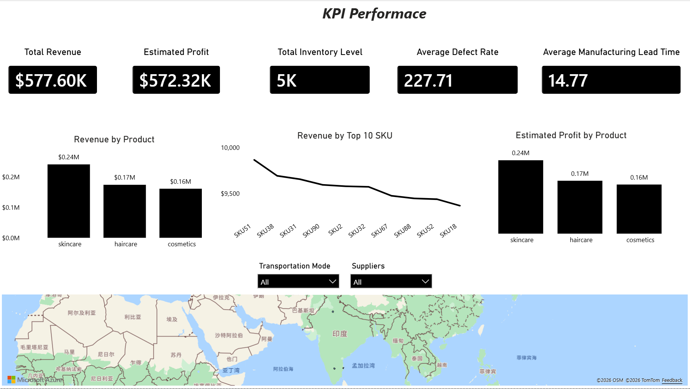
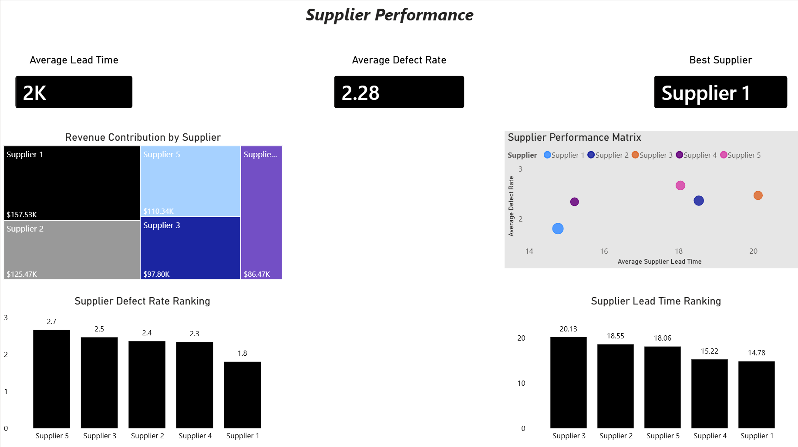
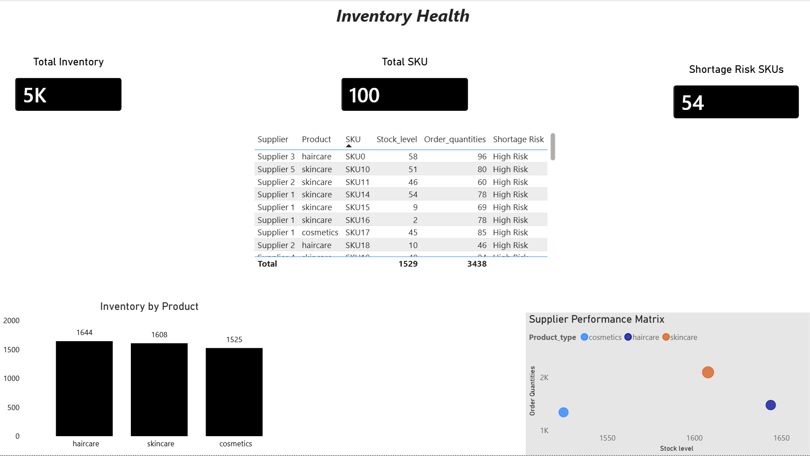
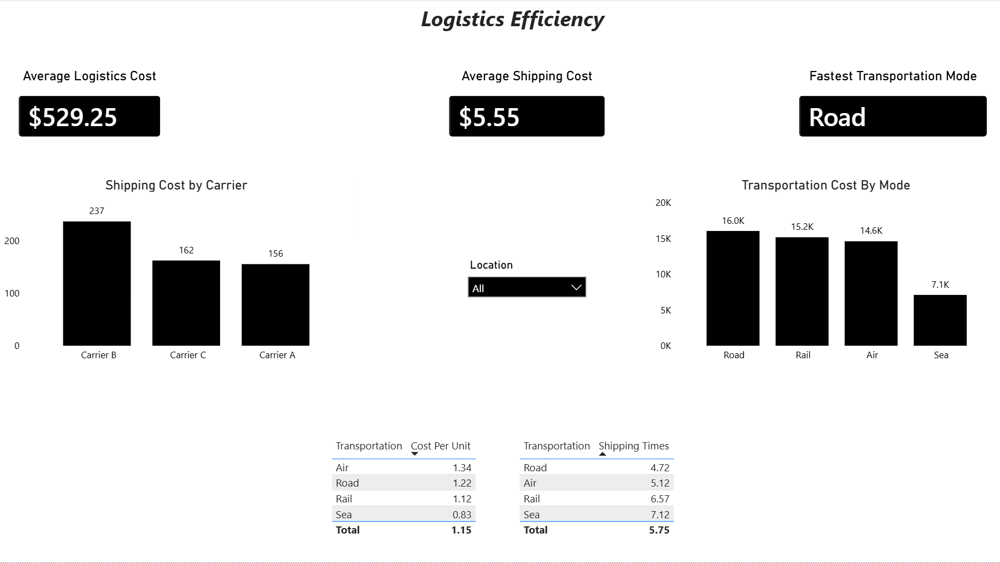

# 📦 Supply Chain Analytics

## Project Overview

This project analyzes end-to-end supply chain performance using SQL and Power BI.

The objective is to evaluate supplier performance, monitor inventory health, analyze logistics efficiency, and identify opportunities to improve operational performance across the supply chain network.

The analysis focuses on four key business areas:

- Supplier Performance
- Inventory Management
- Logistics Efficiency
- Profitability Analysis

---

## Notes

- Estimated Profit was calculated using the following formula:

Estimated Profit = Revenue − Manufacturing Costs − Shipping Costs

- Since the dataset does not provide unit-level production costs or complete operational expenses, this metric should be interpreted as an approximate profitability indicator rather than an accounting profit measure.

- The purpose of this metric is to support relative profitability comparisons across products, suppliers, and categories.

## Business Questions Executed in SQL

Supplier Performance
- Which suppliers contribute the highest revenue?
- Which suppliers have the shortest lead times?
- Which suppliers have the lowest defect rates?
- Which suppliers provide the best balance between lead time, cost, and quality?

Inventory Management
- Which product categories have the highest inventory levels?
- Which products face potential shortage risks?
- How does customer demand compare with current inventory levels?

Logistics Efficiency
- Which transportation mode delivers products the fastest?
- Which transportation mode has the highest transportation cost?
- How do shipping costs vary across shipping carriers?
- What is the average transportation cost per unit shipped?

Profitability Analysis
- Which product categories generate the highest revenue?
- Which products generate the highest estimated profit?
- Which suppliers contribute the highest profit margins?

---

## Tools

- Excel
- SQL (MySQL)
- Power BI
- GitHub

---

## Executive Dashboard

## Supplier Performance Dashboard

## Inventory Dashboard

## Logistics Dashboard

---

## Key Findings

- Supplier 1 demonstrated the strongest overall supplier performance, combining the shortest supplier lead time, lowest defect rate, and one of the highest revenue contributions.

- Skincare products experienced the highest demand pressure, with order quantities exceeding current inventory levels.

- Multiple SKUs were identified as shortage-risk products, indicating potential stockout risks and fulfillment challenges.

- Supplier performance varied significantly across lead time, manufacturing cost, and quality metrics.

- Transportation efficiency differed across transportation modes, highlighting opportunities for logistics optimization.

- Shipping carriers showed noticeable differences in shipping costs and delivery performance.

- Revenue contribution was concentrated among a small number of suppliers, increasing supplier dependency risk.

- Manufacturing lead time showed a positive relationship with defect rates, suggesting that longer production cycles may contribute to operational inefficiencies.

- Inventory distribution varied across product categories, indicating opportunities for inventory optimization.

- Estimated profitability differed across products and suppliers, revealing opportunities to improve product mix decisions.

---

## Business Recommendations

- Strengthen partnerships with high-performing suppliers such as Supplier 1 to improve supply reliability and product quality.

- Increase safety stock levels for shortage-risk SKUs, particularly within the skincare category.

- Implement supplier scorecards based on lead time, defect rate, manufacturing cost, and revenue contribution.

- Diversify supplier sourcing strategies to reduce dependency on a limited number of key suppliers.

- Optimize transportation mode selection by balancing transportation cost and delivery speed.

- Continuously monitor supplier lead times to proactively identify potential supply disruptions.

- Improve demand forecasting and replenishment planning to reduce stockouts and excess inventory.

- Investigate the root causes of higher defect rates among lower-performing suppliers and introduce quality improvement initiatives.

- Develop more detailed cost allocation methods to improve profitability measurement and operational decision-making.

- Establish integrated supply chain KPIs to improve end-to-end operational visibility.

---

## Conclusion

This project demonstrates how SQL and Power BI can be used together to transform raw operational data into actionable supply chain insights.

By integrating supplier analysis, inventory monitoring, logistics optimization, and profitability evaluation, the project provides a comprehensive view of supply chain performance and supports data-driven decision-making.
